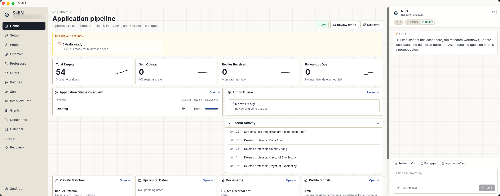
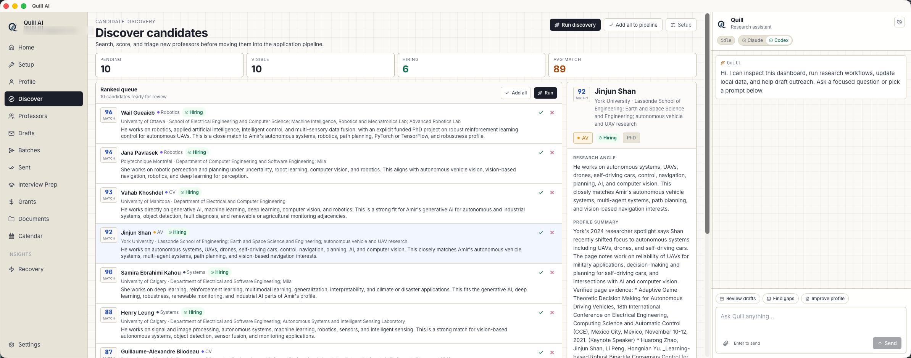
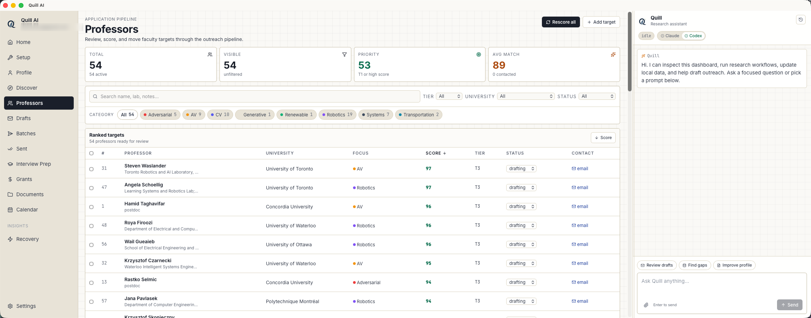
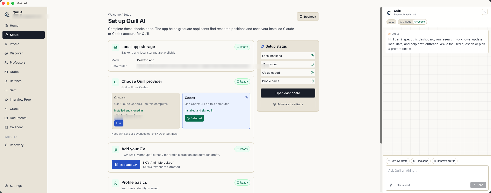

# Quill AI

Quill AI is a local-first desktop research assistant for graduate students,
postdoctoral applicants, and early-career researchers who need to manage
professor discovery, outreach drafts, replies, interview prep, documents,
grants, and follow-ups in one place.

The app runs on your computer with a local database and local document storage.
When you choose an AI provider, Quill uses your own installed Codex or Claude
Code account instead of storing provider passwords inside the app.

<p>
  
</p>

Screenshots were captured from the Quill AI desktop app. Private account and
local path fields are blurred.

## What Quill AI Does

Quill AI helps you run a research-position search as an organized pipeline:

- Build a structured applicant profile from your CV, research interests,
  publications, skills, and target-position preferences.
- Upload CVs, research statements, papers, transcripts, and cover-letter
  templates into local storage.
- Discover professor candidates, score fit, review research angles, and move
  strong matches into the outreach pipeline.
- Track professor status from drafting to sent, replied, interview, offer,
  rejected, or skipped.
- Generate and redraft outreach emails with Quill using Claude Code or Codex.
- Batch-review drafts before sending and optionally send through Gmail.
- Track replies, follow-ups, calendar items, grants, and interview preparation.
- Use the right AI provider for your machine: Claude Code CLI, Codex CLI,
  Anthropic API, or OpenAI API.

## Screenshots

| Application pipeline | Candidate discovery |
| --- | --- |
|  |  |

| Professor pipeline | First-run setup |
| --- | --- |
|  |  |

## Install The Desktop App

The current packaged release is a prerelease: `v0.1.1`.

Download installers from the GitHub releases page:

https://github.com/Amirmoradi94/quill-research-assistant/releases/latest

Available assets in `v0.1.1`:

- macOS Apple Silicon: `Quill.AI_0.1.1_aarch64.dmg`
- Linux x64 AppImage: `Quill.AI_0.1.1_amd64.AppImage`
- Linux x64 Debian package: `Quill.AI_0.1.1_amd64.deb`

### macOS

1. Download `Quill.AI_0.1.1_aarch64.dmg`.
2. Open the DMG and drag `Quill AI.app` into `Applications`.
3. Open Quill AI from `Applications`.
4. If macOS blocks the prerelease because it is not notarized, right-click the
   app, choose `Open`, then confirm.
5. Complete the in-app setup checklist.

### Linux AppImage

```bash
chmod +x Quill.AI_0.1.1_amd64.AppImage
./Quill.AI_0.1.1_amd64.AppImage
```

### Linux Debian Package

```bash
sudo apt install ./Quill.AI_0.1.1_amd64.deb
```

Windows installers are not published yet.

## First-Run Setup

Open `Setup` in the sidebar after launching the app.

Quill checks:

- Local desktop backend and database.
- Local app data folder.
- Installed Claude Code and Codex CLI providers.
- Selected default Quill provider.
- Uploaded CV and basic profile fields.

The setup page can guide provider install and login on macOS. On Linux and
other platforms, install the provider manually, then click `Recheck`.

## Set Up Codex

Quill can use OpenAI Codex through the local `codex` CLI. Install and sign in
before selecting Codex in Quill.

Official Codex CLI install options:

```bash
# macOS or Linux native installer
curl -fsSL https://chatgpt.com/codex/install.sh | sh

# or npm
npm install -g @openai/codex

# or Homebrew
brew install --cask codex
```

Windows PowerShell:

```powershell
powershell -ExecutionPolicy ByPass -c "irm https://chatgpt.com/codex/install.ps1 | iex"
```

Then verify and sign in:

```bash
codex --version
codex login
```

When prompted, choose `Sign in with ChatGPT` if you want Codex to use your
ChatGPT plan. Codex also supports API-key authentication for usage billed
through an OpenAI Platform account.

After login:

1. Open Quill AI.
2. Go to `Setup` or `Settings`.
3. Click `Recheck`.
4. Select `Codex` as the Quill provider.

Sources: [OpenAI Codex docs](https://developers.openai.com/codex) and
[OpenAI Codex CLI README](https://github.com/openai/codex).

## Set Up Claude Code

Quill can also use Anthropic Claude through the local `claude` CLI.

Claude Code requires a Claude Pro, Max, Team, Enterprise, or Console account.
The free Claude.ai plan does not include Claude Code access.

Recommended install:

```bash
# macOS, Linux, or WSL
curl -fsSL https://claude.ai/install.sh | bash
```

Alternative installs:

```bash
# Homebrew
brew install --cask claude-code

# npm, requires Node.js 18+
npm install -g @anthropic-ai/claude-code
```

Windows PowerShell:

```powershell
irm https://claude.ai/install.ps1 | iex
```

Then verify and sign in:

```bash
claude --version
claude doctor
claude
```

The first `claude` run opens a browser login flow. Complete the login, return
to Quill, click `Recheck`, and select `Claude` as the provider.

Source: [Claude Code setup docs](https://code.claude.com/docs/en/getting-started).

## Local Data And Privacy

Quill stores app data locally by default.

Desktop app data paths:

- macOS: `~/Library/Application Support/QuillResearchAssistant`
- Windows: `%APPDATA%/QuillResearchAssistant`
- Linux: `$XDG_DATA_HOME/QuillResearchAssistant` or
  `~/.local/share/QuillResearchAssistant`

Developer browser mode stores data in:

```text
dashboard/data
```

The local desktop folder includes the SQLite database, uploaded documents, and
sidecar logs. AI providers receive only the context required for a workflow
that you explicitly run.

## Developer Setup

Use this path if you are contributing to the app or running from source.

Requirements:

- Node.js `>=20.20 <25`
- Python 3.12 recommended for local backend scripts
- Rust and Cargo for Tauri desktop builds
- macOS, Linux, or Windows development environment supported by Tauri

Install frontend dependencies:

```bash
cd web
npm install
```

Run the backend:

```bash
scripts/start_backend_local.sh
```

Run the frontend in another terminal:

```bash
npm --prefix web run dev -- --host 0.0.0.0 --port 5173
```

Open:

```text
http://localhost:5173
```

Run the desktop development shell:

```bash
cd web
npm run desktop:dev
```

Build the desktop package:

```bash
cd web
npm run desktop:build
```

The desktop build bundles two sidecar binaries:

- `postdoc-backend`
- `postdoc-scraper`

On macOS release builds, use the release-fix script after packaging if you need
to re-sign the app bundle and recreate the DMG:

```bash
scripts/fix_macos_release_package.sh
```

## Troubleshooting

### Quill Does Not Detect Codex Or Claude

1. Open a new terminal.
2. Run `codex --version` or `claude --version`.
3. If the command is missing, reinstall the provider or fix your `PATH`.
4. If the command works in Terminal but not Quill, open `Settings`, click
   `Recheck`, or restart Quill.

### macOS Does Not Open Terminal For Guided Setup

macOS may block Quill from controlling Terminal. Open:

```text
System Settings > Privacy & Security > Automation
```

Allow Quill AI to control Terminal, then retry the setup action.

### Backend Is Still Starting

The desktop app starts a local FastAPI sidecar. On cold launch, the UI may show
`Starting backend` briefly. If it does not clear, restart Quill and check the
sidecar logs in the local app data folder.

### Gmail Sending Is Disabled

Gmail sending requires a Gmail App Password and 2-Step Verification on the
Google account. Configure it from `Settings > Gmail`.

## Project Structure

```text
app/                  FastAPI backend and local data workflows
ai/                   Quill provider runner and prompt templates
scraper/              Professor page scraping sidecar
web/                  React, Vite, and Tauri desktop frontend
web/src-tauri/        Tauri 2 desktop shell
scripts/              Local development and release helpers
docs/                 Plans and README screenshots
```

## Status

Quill AI is usable as a prerelease desktop app. The current release focuses on
local-first workflows, provider detection, document upload, candidate discovery,
draft generation, reply tracking, interview prep, and desktop packaging.

Expected future work includes broader platform packaging, stronger release
signing and notarization, and continued polish for non-technical onboarding.
