# Design Research: Postdoc Dashboard Redesign

> Generated 2026-05-04. Light-mode-only research for a self-hosted, AI-augmented postdoc application tracker.
> Aesthetic anchor: "calm tools" (Linear, Attio, Notion, Vercel, Cursor) — warmer / more academic, not enterprise-blue.

## TL;DR

Build a **left-sidebar** layout with a **dimmed paper-toned sidebar** (Linear's March-2026 refresh pattern) and a **right-side AI activity drawer** that streams agent output (VS Code Agent / Manus / Cursor pattern). Use **table + Kanban toggle** for the professor list (Huntr-meets-Teal: visual board for triage, dense table for editing). Inline **✨ action buttons** with Accept / Dismiss / Save-for-later for any AI-generated change — never auto-apply. Onboarding is a 3-step wizard with a vertical progress rail (TBR / Stripe pattern), pre-populating profile from the user's CV + Scholar URL + personal page.

---

## Recommendations / Next Steps

### 1. Adopt left-sidebar nav with dimmed surface, content area pops

Linear's March 2026 UI refresh dimmed sidebars to make the main content area stand out. We adopt the same: paper-tone sidebar (`#f5f3ee` — slightly darker than main `#fbfaf7` paper) so the work area feels brighter. Single-pixel divider, no shadow, no gradient.

```
┌──────────┬────────────────────────────────────┬──────┐
│ AM ▾     │   Home                          ⏎  │      │
│          │   ─────────────────────────────────│      │
│ ⌂ Home   │                                    │   ✨ │
│ 🔍 Disc. │   Good evening, Amir               │   ai │
│ 👥 Profs │   ─ 3 follow-ups due ─             │   on │
│ ✉ Drafts │   ┌────┬────┬────┬────┬────┬────┐  │      │
│ 📤 Batch │   │ 47 │ 23 │ 18 │ 5  │ 3  │ 12%│  │      │
│ 💰 Grants│   │tot │sent│reply│int │off │ rr │  │      │
│ 📁 Docs  │   └────┴────┴────┴────┴────┴────┘  │      │
│ 📅 Cal   │                                    │      │
│ 📊 Activ │   Status breakdown   By university │      │
│ ⚡ AI    │   [stacked bars]      [bar list]   │      │
│ ⚙ Sett.  │                                    │      │
└──────────┴────────────────────────────────────┴──────┘
```

### 2. Right-side AI Activity Drawer with streaming output

Pattern from VS Code Agent + Manus + Cursor: a persistent, collapsible 400px drawer on the right that streams what AI is doing now. Show step-by-step intermediate output (Cursor's "reasoning close to code" model — Devin's delegation-then-result pattern hides too much for our use case). Cancellable. Multiple runs queue with status pills.

```
                                          ┌──────────────────┐
                                          │ AI Activity   ✕  │
                                          ├──────────────────┤
                                          │ ⏳ Researching   │
                                          │ Prof Singh @ UofT│
                                          │ ─────────────────│
                                          │ ✓ Found profile  │
                                          │ ✓ Fetched lab    │
                                          │ ⏳ Summarizing… │
                                          │ ┊                │
                                          │ ┊ "Currently work-│
                                          │ ┊ ing on multi-  │
                                          │ ┊ agent RL for…"│
                                          │                  │
                                          │ [Cancel]  [Hide] │
                                          ├──────────────────┤
                                          │ Queue (2)        │
                                          │ • Draft email…   │
                                          │ • Find grants…   │
                                          └──────────────────┘
```

### 3. Hybrid table-and-Kanban toggle for the professor list

Huntr's Kanban is great for triage; Teal's spreadsheet is great for editing. Ship both views with a top-right toggle. Same data, same filters, same color-coding — only the layout changes. Default to **List** for first-load (info density), let users switch to **Board** for status-drag.

```
┌────────────────────────────────────────────────────────┐
│ Professors                          [≡ List][▦ Board]  │
│ ─────────────────────────────────────────────────────  │
│ Filter: [all] tier [all] status [all] uni [all] cat ⌫  │
│ ─────────────────────────────────────────────────────  │
│  #   Name             Uni        Tier  Status   Cat    │
│  47  Prof. Singh      UofT       T1   drafting  ●AV    │
│  46  Prof. Chen       McGill     T2   sent      ●RL    │
│  ...                                                    │
└────────────────────────────────────────────────────────┘
```

### 4. Inline ✨ AI action buttons with Accept / Dismiss / Save

Smart-Compose-style discovery — the action sits where the user is already looking (on the row, in the modal, next to the field). When AI proposes a structured change, surface it as a **suggestion chip** the user explicitly accepts or dismisses. Never auto-write to the database.

```
┌─ Edit Professor ─────────────────────────────┐
│ Name        Prof. Aisha Singh                │
│ University  University of Toronto            │
│ Email       a.singh@cs.toronto.edu  ✨       │
│ Lab URL     [empty]              [✨ Auto-fill]│
│             ↳ ┌──── AI suggestion ─────────┐ │
│               │ https://utml.toronto.edu   │ │
│               │ Confidence: 94%            │ │
│               │ [ Accept ✓ ] [ Dismiss ✕ ] │ │
│               └────────────────────────────┘ │
└──────────────────────────────────────────────┘
```

### 5. Three-step onboarding wizard with vertical progress rail

Stripe + TBR pattern: vertical rail on the left, current step in main area, "Continue" only enables once required fields valid. Prefill aggressively (from CV upload), show conflict resolution explicitly.

```
┌────────────────────────────────────────────────────┐
│  ●─── Welcome                                      │
│  │                                                 │
│  ●─── Bring your work                              │
│  │     ┌──────────────────────────────────────┐    │
│  │     │  Drop your CV (PDF) here or browse  │    │
│  │     │  ──────────────────────────────────  │    │
│  │     │  Google Scholar URL  [_________]    │    │
│  │     │  Personal page URL   [_________]    │    │
│  │     └──────────────────────────────────────┘    │
│  │                          [Skip] [Continue →]    │
│  ○─── Review your profile                          │
└────────────────────────────────────────────────────┘
```

### 6. Discovery / Suggestions inbox — ranked cards with explanation

Spotify-Discover-Weekly meets Superhuman triage: each AI-found candidate is a card with a match-score badge, 1-line "why this matched" explanation, and three explicit actions. Soft-delete on dismiss so we never re-suggest.

```
┌─ Professor Suggestions (12 new) ──────────────────┐
│ ┌───────────────────────────────────────────────┐ │
│ │ 92% match   Prof. Lin Hou   MIT  T1  ●AV     │ │
│ │ ─────────────────────────────────────────────│ │
│ │ "3 papers on adversarial AV in 2024-25;     │ │
│ │  co-authored with Prof. Khan in your list"  │ │
│ │  [Accept] [Save for later] [Dismiss]        │ │
│ └───────────────────────────────────────────────┘ │
│ ┌───────────────────────────────────────────────┐ │
│ │ 88% match   Prof. Chen   ETH   T1  ●Robotics │ │
│ │ "Lab actively hiring postdocs (lab page)…"   │ │
│ │  [Accept] [Save for later] [Dismiss]        │ │
│ └───────────────────────────────────────────────┘ │
└────────────────────────────────────────────────────┘
```

---

## Key Examples

### Home / overview dashboard


*Glean — line chart on top, dense activity log below, KPI cards. Information density target. [Lazyweb]*

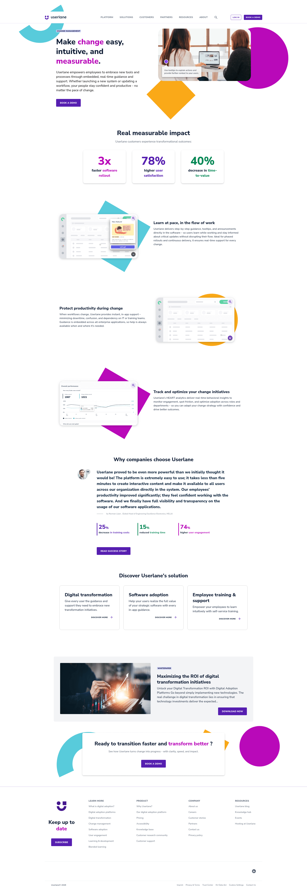
*Userlane — flat KPI cards with mixed bar/line charts. The percentages-with-context pattern is what we want for "23% response rate" etc. [Lazyweb]*

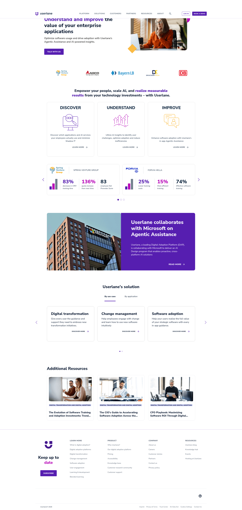
*Userlane — Plan/Build/Improve segmented progress with collapsible value streams. Adapt this for our drafting → sent → replied pipeline. [Lazyweb]*

### Contacts list (table view)

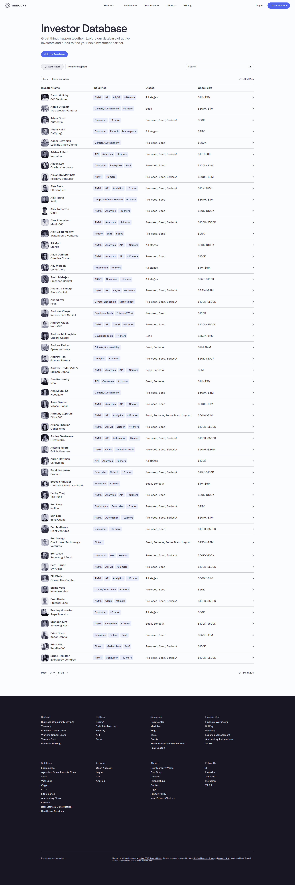
*Mercury — searchable, filterable investor table with industry tags + funding-stage chips. Columns are scannable, no overflow. [Lazyweb]*

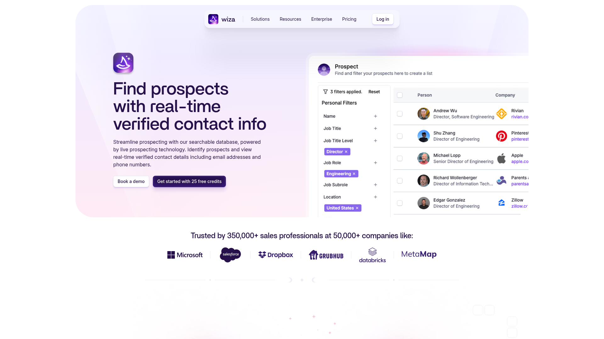
*Wiza — search-driven prospect grid with quick-action chips per row. Useful for the Discovery inbox card design. [Lazyweb]*

### Pipeline / Kanban

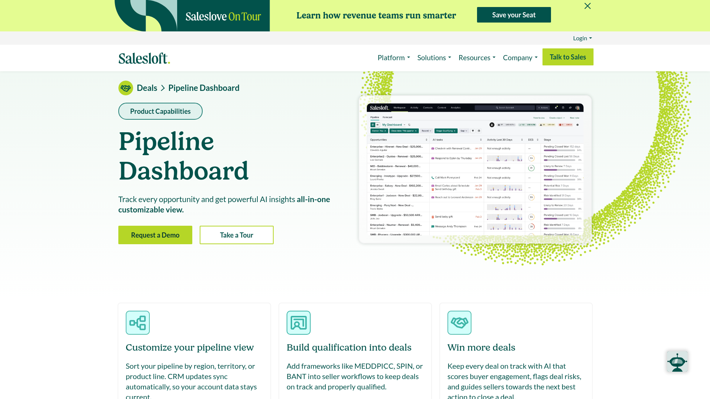
*Salesloft — pipeline with AI-powered deal tracking, "automatic data scoring," custom alerts. Closest analog to AI-augmented postdoc pipeline. [Lazyweb]*

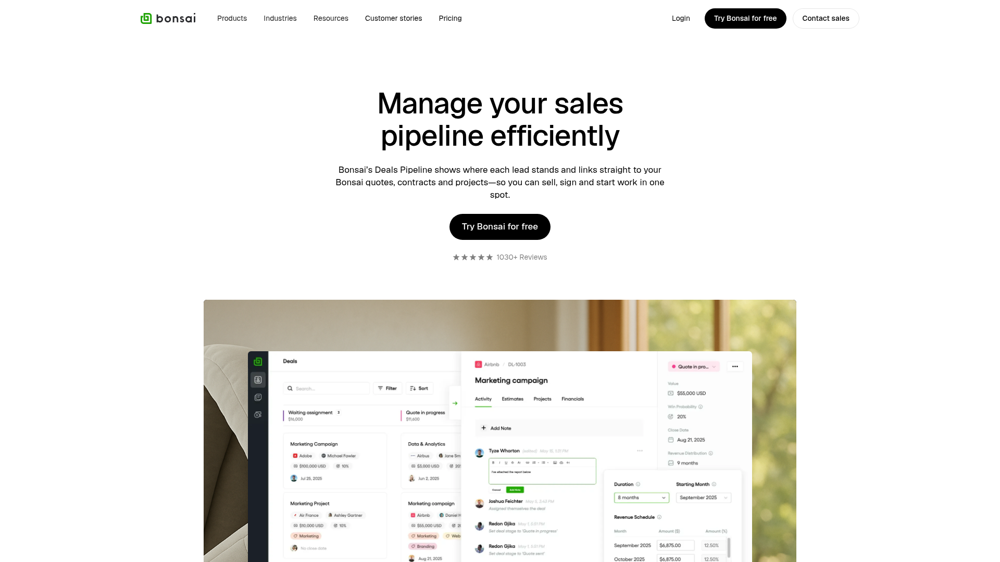
*Bonsai — clean 4-stage kanban (New, Qualified, Proposal, Won). Horizontal scroll, bordered columns. Direct template for our Drafting → Sent → Replied → Interview → Offer. [Lazyweb]*

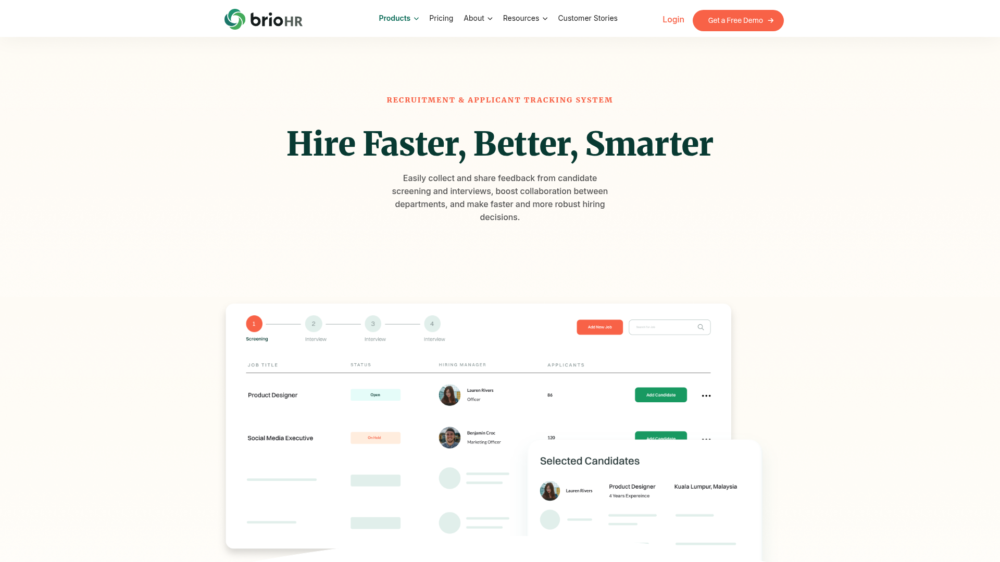
*BrioHR — ATS pipeline with stage cards + side preview panel. The split-pane "click row → preview" pattern fits the professor modal. [Lazyweb]*

### AI / streaming / chat

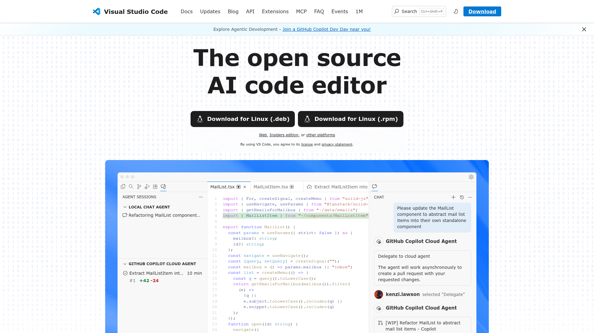
*VS Code Agent — right-side chat panel for "Cloud Agent for AI-assisted development." Drawer width and message density to copy. [Lazyweb]*

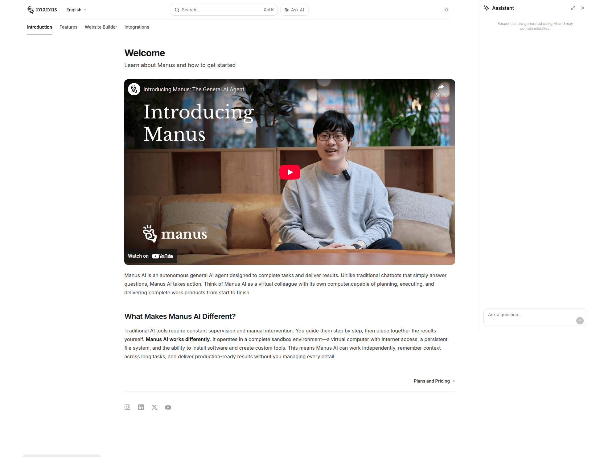
*Manus — global "Ask AI" button in top bar + persistent right-side AI assistant panel. Exactly our chat sidecar pattern. [Lazyweb]*

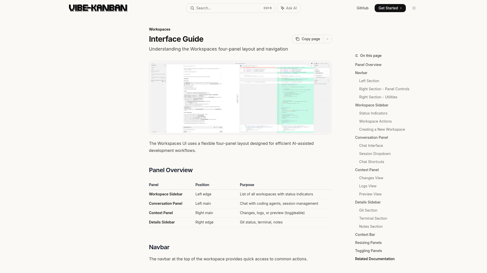
*Vibe-Kanban — 4-panel workspace (sidebar / main / right rail / chat). Reference for the overall page chrome. [Lazyweb]*

### Email composer

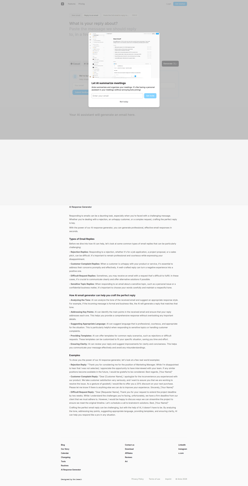
*Amie — AI email response generator with email-style preview. Reference for the email body + tone-variant chip pattern. [Lazyweb]*

### Document manager

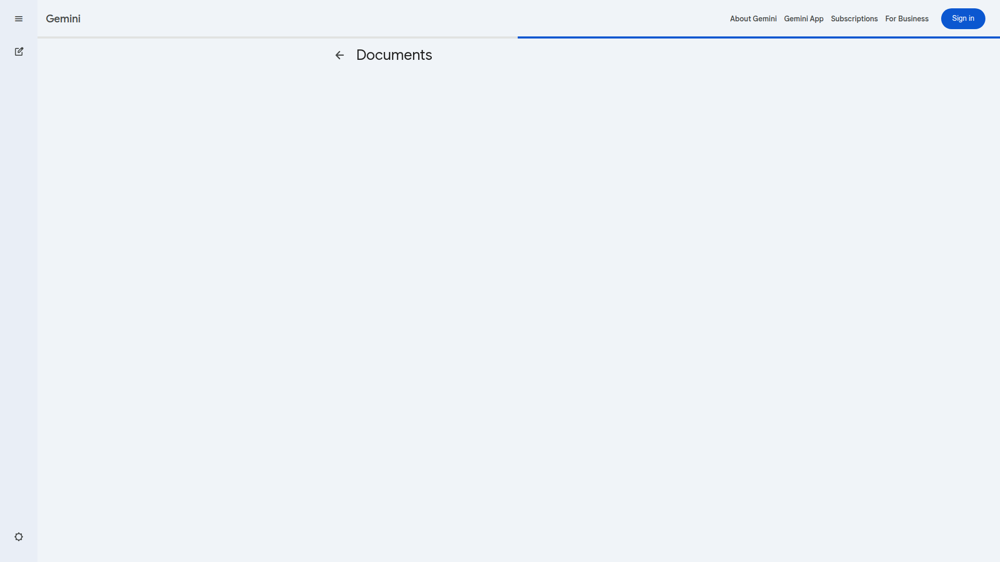
*Gemini — minimal documents library with sidebar nav + file list. Restrained, no superfluous chrome. [Lazyweb]*

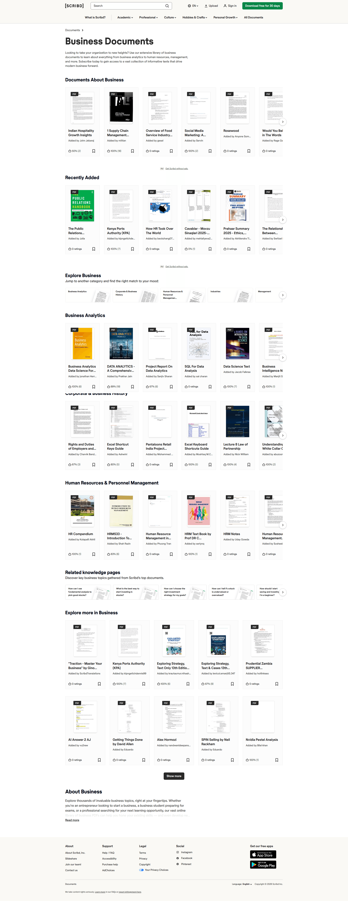
*Scribd — PDF-card grid layout. Useful when we have visual previews (sample papers, CV thumbnails). [Lazyweb]*

### Onboarding wizard

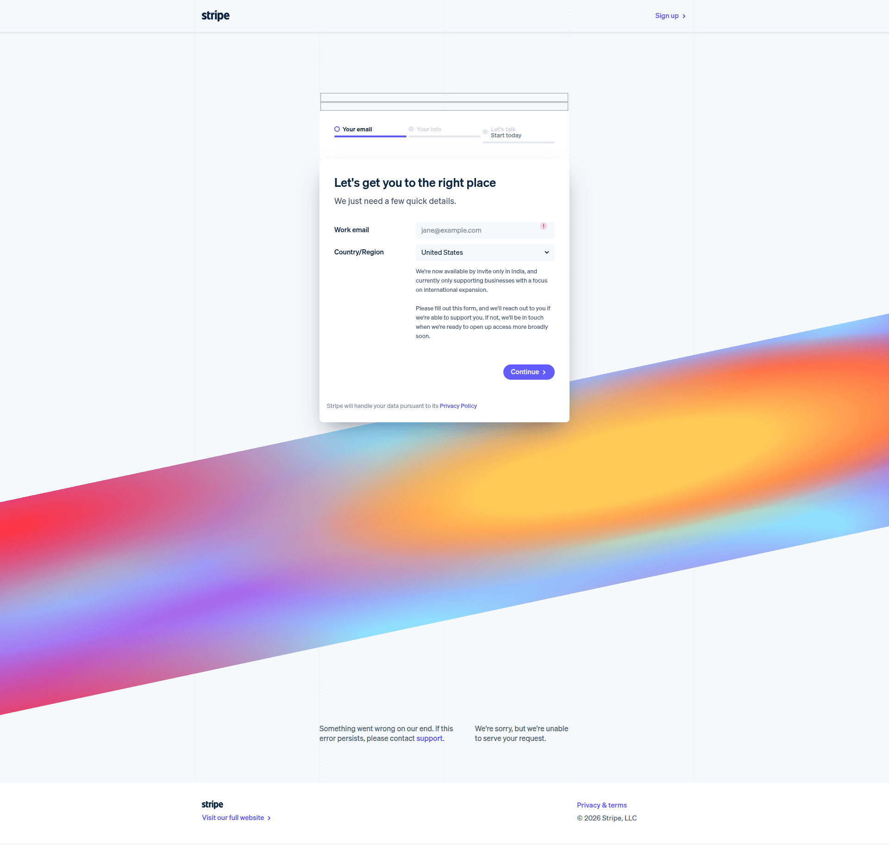
*Stripe — multi-step signup with progress bar + regional routing. Calm, one-thing-per-screen. [Lazyweb]*

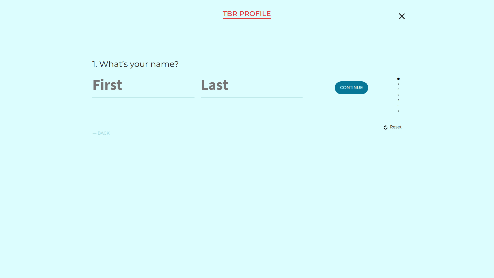
*TBR — vertical progress indicator on the left, single form per step. Direct template for our 3-step wizard. [Lazyweb]*

### Settings / integrations

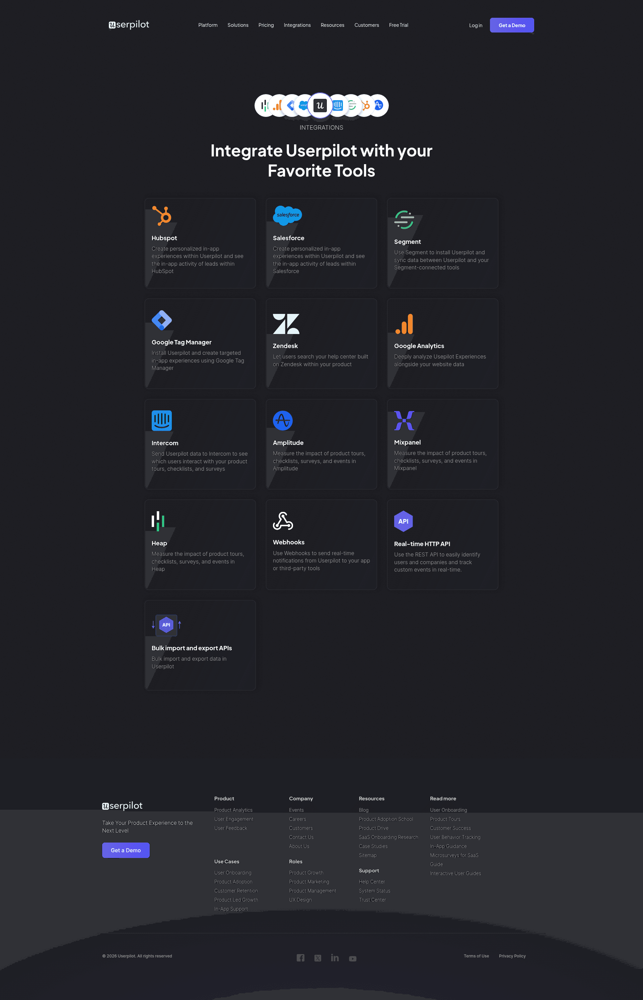
*Userpilot — grid of integration tiles with "Connect" CTA per card. Useful for Settings → AI Providers screen (Claude CLI / Codex CLI / Anthropic API / OpenAI API tiles). [Lazyweb]*

---

## Patterns

These are the table-stakes the best examples share:

1. **Sidebar dimmer than main canvas** — Linear's 2026 refresh makes this explicit; everyone good is doing it now. Sidebar is `#f5f3ee` ish, content is `#fbfaf7` paper.
2. **Single accent color, never two** — Linear, Attio, Vercel all pick one accent (blue / orange / black) and stick to it. We pick the existing brand blue (`#3b6fe0`).
3. **Status as colored pill, not colored row** — Pills with emoji + label scan faster than fully-tinted rows. The current dashboard already does this — keep it.
4. **Information density beats hero whitespace** — Mercury's investor table, Salesloft's pipeline, Glean's activity log all push density. Padding is `px-3 py-2`, not `px-6 py-4`.
5. **Right rail for AI / right rail for context** — VS Code Agent, Manus, Cursor, Vibe-Kanban: any AI-augmented tool puts the agent surface on the right, never the left. We follow.
6. **Inline ✨ buttons over global "AI" mode** — Notion AI proved that contextual sparkle buttons beat a separate "AI mode." We embed actions where the user already is.
7. **Suggestion = explicit accept/dismiss** — Never auto-apply AI writes. Always show a chip the user clicks Accept / Dismiss on.
8. **Empty states teach** — Linear's empty states use clear copywriting + primary/secondary CTAs. Don't ship a `(no data)` screen; ship a "Run Discovery to find your first 30 professors" CTA.

## Anti-Patterns

Specific things to avoid, with examples:

1. **❌ Top-tab nav for >6 sections** — The current dashboard already has 6 tabs and it's at the limit. Going to 10 pages without sidebar is unscannable.
2. **❌ Glassmorphism / blur effects** — Calm-tools school doesn't blur; it relies on color, type, and grid. Skip Apple-style blur entirely.
3. **❌ Floating-action-button (FAB) for AI** — Material-Design-style FAB is fine for mobile but feels out of place in a dense desktop tool. Use inline ✨ buttons.
4. **❌ Auto-applying AI writes without diff** — A drafter that just rewrites your email body without showing you the diff is hostile. Always show a preview.
5. **❌ "Start a chat" empty states** — Empty state says "no professors yet" with a chat box is the laziest pattern. Show a *button* that triggers a real workflow ("Find professors").
6. **❌ Two-column form layouts on narrow screens** — Onboarding form should reflow to single-column under 900px. Don't make people horizontally scan.
7. **❌ Long-running operations without cancel** — Devin's "delegate and wait" model fails for users who want to course-correct. Always show "Cancel" on any AI run >5s.
8. **❌ Marketing-page screenshots in product UIs** — Half the Lazyweb results in this corpus are landing pages dressed up as dashboards. Don't ship a hero section in your settings page.

## Unique Angles

The standout things from the references — moments worth stealing specifically:

- **Linear's "calmer interface" framing.** Their March 2026 refresh writeup says explicitly: *"Navigation sidebars are slightly dimmer, allowing the main content area to stand out."* That single decision (dim the chrome, brighten the content) does more for perceived calm than any other change. Steal exactly.
- **Cursor's "reasoning close to the code" principle.** Don't hide the AI's intermediate steps. The user wants to see "fetched profile → extracted email → summarizing…" *as it happens*. The Devin model (fire and forget) loses trust on long runs. Our streaming drawer must show every step.
- **Manus's `Ask AI` button in the global toolbar.** A persistent "Ask AI" entry point in the top bar, separate from the main chat sidecar, means the user can summon the assistant from any page without context-switching. We add this.
- **Bonsai's stage-card density.** Each kanban card has name + value + date + status — four pieces of info in ~40px of vertical space. Achievable because of tight typography (12px + bold name on top). Match this.
- **Smart Compose's "Tab to accept" gesture.** For inline text suggestions in the email composer, render the AI's continuation in light gray text and bind Tab to accept. Lower-friction than a chip click.
- **Huntr's Kanban + Teal's spreadsheet, one product.** Don't pick — ship both views over the same data with a single toggle. Different mental modes for the same user across the day.

---

## Findings

### What changed since this dashboard was first built

The current dashboard was built before two design shifts crystallized:

1. **AI as inline affordance, not a separate mode.** Notion AI in 2024–25 proved that "press / for AI" beats "switch to AI mode" — and Linear, Cursor, Lovable all followed. The redesign should embed AI everywhere, not gate it behind a tab.
2. **Right-rail agent panels are now a primitive.** VS Code Agent (2025), Cursor's agent mode (2025), Lovable's Chat Mode (Feb 2026), and Manus all converged on the same right-rail streaming panel. Users coming to the new dashboard will already know how to use it.

### Why the corpus is weaker than ideal for our needs

Lazyweb skews to **marketing landing pages** rather than authenticated product UIs. We saw lots of "here's a screenshot of our SaaS dashboard" rather than the dashboards themselves. The strongest matches in this report (Glean, Userlane, Mercury, Bonsai) are all marketing-page product previews — directionally correct but not pixel-perfect references. For pixel-perfect work I'd recommend supplementing with a Mobbin or SaaSUI subscription on the implementation step.

### Why we should *not* over-index on Linear specifically

Linear is the loudest reference but it's a project-management tool with a *team* in mind. Our product is single-user, document-heavy, AI-augmented. We borrow Linear's *information-density and calm-chrome principles*, not their team-collab features (pulse, cycles, etc.). Equally important is Attio's record-page pattern (single contact = full page, not modal) — we may want to graduate the professor *modal* into a full page on Phase 2.

---

## Sources

**Lazyweb screenshots:** cited inline in Key Examples above.

**Web research (current trends):**
- [How we redesigned the Linear UI (part Ⅱ)](https://linear.app/now/how-we-redesigned-the-linear-ui)
- [Linear UI refresh changelog (March 2026)](https://linear.app/changelog/2026-03-12-ui-refresh)
- [A calmer interface for a product in motion — Linear](https://linear.app/now/behind-the-latest-design-refresh)
- [Devin vs Cursor: Developers choose AI tools 2026](https://www.builder.io/blog/devin-vs-cursor)
- [The AI Agent Stack in 2026](https://thenuancedperspective.substack.com/p/the-ai-agent-stack-in-2026)
- [AI Coding Agents 2026 — DeepFounder](https://deepfounder.ai/ai-coding-agents-2026-guide/)
- [Best Job Tracker Apps 2026](https://prentus.com/blog/we-found-the-5-best-job-tracker-tools-on-the-market)
- [Huntr vs Teal vs Careerflow](https://www.careerflow.ai/blog/huntr-vs-teal-vs-careerflow)
- [AI UX patterns for design systems (part 1)](https://thedesignsystem.guide/blog/ai-ux-patterns-for-design-systems-(part-1))
- [Empty State UX Examples & Best Practices — Pencil & Paper](https://www.pencilandpaper.io/articles/empty-states)
- [Linear Empty State teardown — SaaSUI](https://www.saasui.design/pattern/empty-state/linear)
- [Onboarding on Linear Desktop — Page Flows](https://pageflows.com/post/desktop-web/onboarding/linear/)
